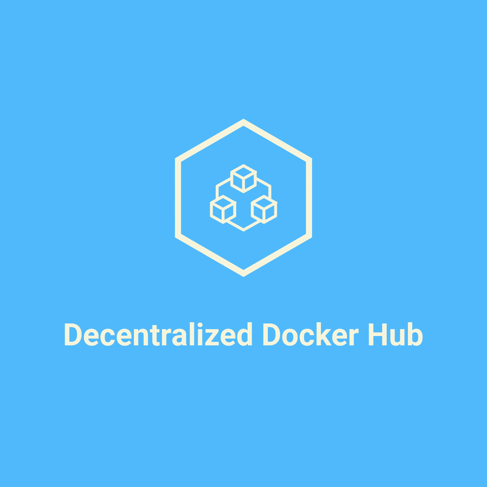

# Decentralized Docker Hub Registry



Decentralized Docker Hub Registry allows you to push and pull docker images from IPFS. It
provides a native docker integration via a custom docker registry server (v2). It is powered by 
Textile Hub and Textile Buckets. It also has support for Fleek Space Daemon.
Decentralized Docker Hub Registry has support for encryption and team sharing via Textile Hub.
Custom cron scripts can be written to periodically backup the buckets containing the Docker images to Filecoin.


# Getting Started

1. Install Node (v12.10.0 or above)

2. Add an entry in your hosts file

   ```
   sudo vi /etc/hosts 
   ``` 
   
   Add the following line at the end
   
   ```
   127.0.0.1       localhost.docker
   ```

3. Update docker daemon to only have one max concurrent upload

   By default the Docker daemon will push five layers of an image at a time. However
   we only support only one max concurrent upload at a time. Hence update max-concurrent-uploads to 1 
   for your docker daemon. 

## Select one of the approach for running the docker registry server

1. Textile Hub
2. Textile Hub via Fleek Space Daemon


### Textile Hub
1. Setup Textile Hub 

      Select one of the below approaches (Textile Hosted Textile Hub or Self Hosted Textile Hub)
        
      1) Textile Hosted Textile Hub
         https://docs.textile.io/hub/accounts/
         
            1) Download the Hub CLI binary from the release landing page and install it: https://github.com/textileio/textile/releases/latest
            2) On MacOS you will need to confirm that it is okay to run the hub binary before it runs successfully. 
            3) The next step is to initialize an account. The Hub CLI uses a magic-link signin, so it only requires you to enter and verify a valid email.
            
               ```
               hub init
               ``` 
               
            4) Create hub keys
            
               ```
               hub keys create
               ```
               
               Select API key type as account and Require Signature Authentication as N
               
               Then note down hub key and secret. It will be required for the further steps
      
      2)  Self Hosted Textile Hub 
      
          1) Clone Textile Repo
             ```
             git clone https://github.com/textileio/textile.git
             cd textile
             ```
          
          2) Ensure that make, docker and docker-compose are installed for your OS
          
          3) Start Textile Bucket containers
             ```
             make buck-up
             ```
          
          4) HUB_KEY and HUB_SECRET env variable will be empty for this case

             
2. Clone Decentralized Docker Hub Registry repo
 
   ```
   git clone https://github.com/viraja1/decentralized_docker_hub_registry.git
   cd decentralized_docker_hub_registry/hub
   ```
 
3. Install packages
 
   ```
   npm install
   ```
    
4. Add env variables
 
   ```
   export BUCKET_ENCRYPTION=true
   export HUB_KEY=
   export HUB_SECRET=
   ```
    
   For HUB_KEY and HUB_SECRET, use the values from the previous steps.
    
   For self hosted Textile Buckets, an extra env variable is required for host
    
   ```
   export HUB_HOST=http://127.0.0.1:3007
   ```
    
5. Start server
 
   ```
   node server.js
   ```
    
6. Determine the docker image that you want to push to IPFS and tag it for localhost.docker:3000 repo
  
   ```
   docker image tag {image_name}:{tag} localhost.docker:3000/{image_name}:{tag}
   ```
 
7. Push the docker image to IPFS via customer docker registry server
  
   ```
   docker push localhost.docker:3000/{image_name}:{tag}
   ```
     
8. Pull the docker image from IPFS via customer docker registry server
 
   ```
   docker pull localhost.docker:3000/{image_name}:{tag}
   ```
    
    
### Textile Hub via Fleek Space Daemon
1. Run Fleek Space Daemon

   https://docs.fleek.co/space-daemon/getting-started/#installation 
   
2. Clone Decentralized Docker Hub Registry repo
 
   ```
   git clone https://github.com/viraja1/decentralized_docker_hub_registry.git
   cd decentralized_docker_hub_registry/daemon
   ```
 
3. Install packages
 
   ```
   npm install
   ```
   
4. Generate Key Pair

   ```
   node generate_key_pair.js
   ```
   
   Note down the generated token and set it as an environment variable
   ```
   export DAEMON_TOKEN= 
   ```

5. Start server
 
   ```
   node server.js
   ```
    
6. Determine the docker image that you want to push to IPFS and tag it for localhost.docker:3000 repo
  
   ```
   docker image tag {image_name}:{tag} localhost.docker:3000/{image_name}:{tag}
   ```
 
7. Push the docker image to IPFS via customer docker registry server
  
   ```
   docker push localhost.docker:3000/{image_name}:{tag}
   ```
     
8. Pull the docker image from IPFS via customer docker registry server
 
    ```
    docker pull localhost.docker:3000/{image_name}:{tag}
    ```